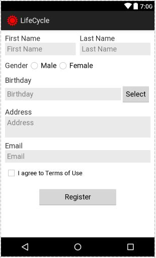

Lập trình ứng dụng nhập dữ liệu.
+ Tạo giao diện như ảnh minh họa
  
+ Để nhập dữ liệu cho ngày sinh, sử dụng widget CalendarView thiết lập ẩn/hiện bên dưới EditText nhập ngày sinh. Khi người dùng nhấn nút Select thì hiện CalendarView, người dùng chọn ngày sinh trên CalendarView thì tự động cập nhật vào EditText. Khi nhấn lại nút Select thì sẽ ẩn CalendarView.
+ Khi người dùng nhấn Register thì cần kiểm tra tất cả các thông tin đã được điền hay chưa. Nếu có thông tin nào chưa được điền thì đổi màu nền của đối tượng nhập dữ liệu tương ứng thành màu đỏ.
